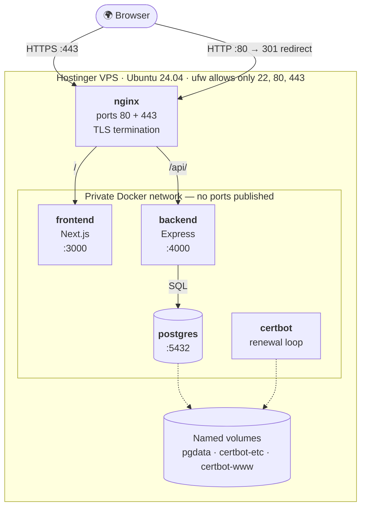
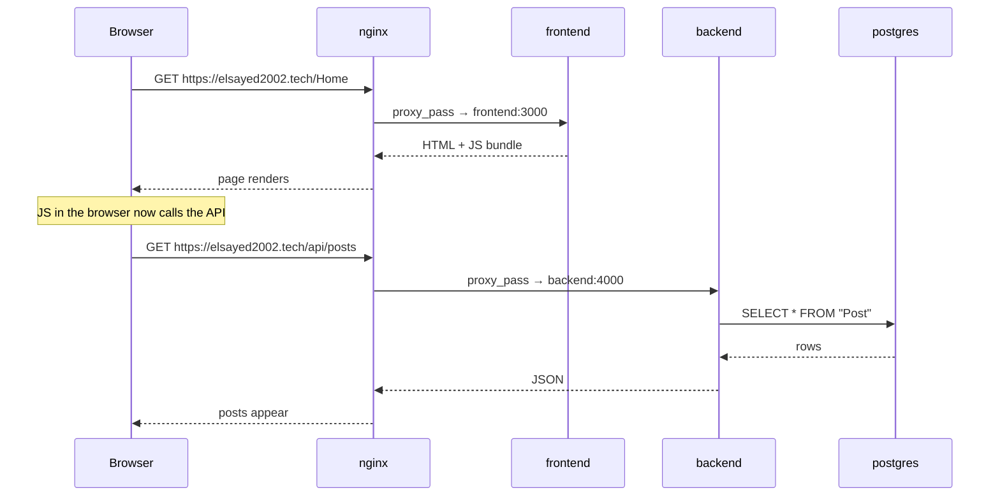
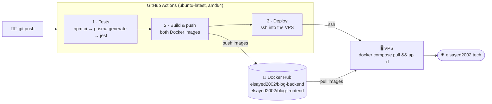
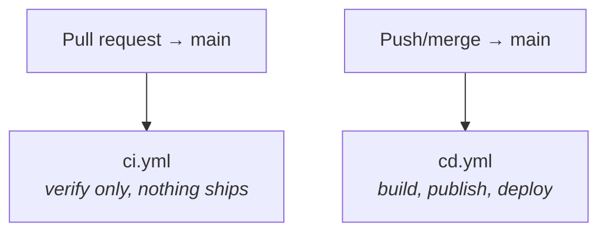
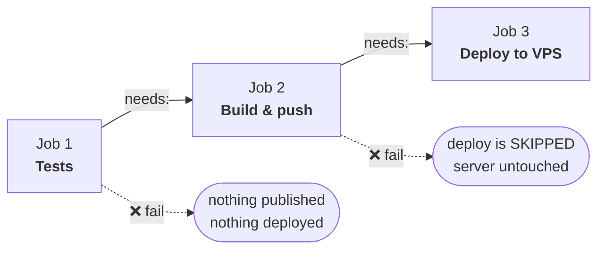
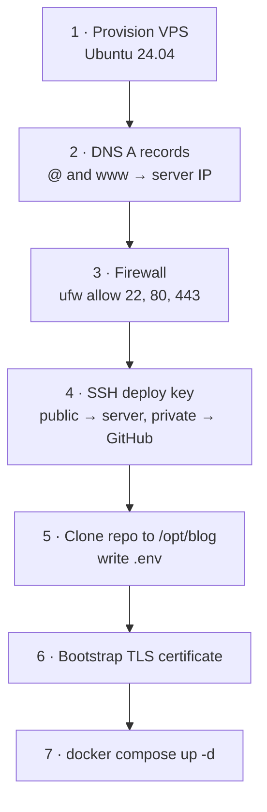

# Blog Application

A full-stack blog, containerized and deployed to a VPS with automated CI/CD.

**🌐 Live: [https://elsayed2002.tech](https://elsayed2002.tech)**

| Layer | Technology |
|---|---|
| Frontend | Next.js 14 (App Router), TypeScript, Tailwind CSS, MUI |
| Backend | Node.js, Express, TypeScript, Prisma ORM |
| Database | PostgreSQL 16 |
| Reverse proxy | nginx (TLS termination, routing) |
| TLS | Let's Encrypt via certbot (auto-renewing) |
| Containers | Docker + Docker Compose |
| CI/CD | GitHub Actions → Docker Hub → VPS |
| Host | Hostinger VPS (KVM 1), Ubuntu 24.04 |

---

## Table of Contents

- [Repository layout](#repository-layout)
- [Architecture](#architecture)
- [Running locally](#running-locally)
- [The Docker setup](#the-docker-setup)
- [Production stack](#production-stack)
- [CI/CD pipeline](#cicd-pipeline)
  - [What `ci.yml` does](#what-ciyml-does)
  - [What `cd.yml` does](#what-cdyml-does)
  - [Secrets and variables](#secrets-and-variables)
- [First-time server setup](#first-time-server-setup)
- [Day-to-day operations](#day-to-day-operations)
- [Gotchas worth knowing](#gotchas-worth-knowing)

---

## Repository layout

```
Blog-Application/
├── frontend/                     # Next.js app
│   ├── app/                      # App Router pages
│   ├── Components/               # React components
│   ├── lib/api.ts                # API client (reads NEXT_PUBLIC_API_URL)
│   ├── Dockerfile
│   └── .dockerignore
│
├── backend/                      # Express API
│   ├── src/
│   │   ├── routes/               # /api/posts, /api/comments
│   │   ├── controllers/          # request validation
│   │   ├── services/             # Prisma queries (unit-tested)
│   │   └── middleware/           # error handler
│   ├── prisma/schema.prisma      # Post + Comment models
│   ├── tests/                    # Jest + supertest (Prisma mocked)
│   ├── Dockerfile
│   └── .dockerignore
│
├── nginx/conf.d/default.conf     # reverse proxy + TLS config
├── docker-compose.yml            # LOCAL development stack
├── docker-compose.prod.yml       # PRODUCTION stack
├── .env.prod.example             # template for the server's .env
└── .github/workflows/
    ├── ci.yml                    # runs on pull requests
    └── cd.yml                    # runs on push to main
```

---

## Architecture

### Production

Everything runs in containers on a single VPS. **Only nginx is exposed to the internet** — the app containers and the database live on a private Docker network with no published ports.



### How one request flows



Because the API is served from the **same domain** under `/api`, the browser never makes a cross-origin request — no CORS preflight, no third-party cookie issues.

---

## Running locally

### Option A — native (fastest feedback loop)

You need a PostgreSQL database running somewhere.

```bash
# 1. Backend
cd backend
cp .env.example .env          # edit DATABASE_URL to match your Postgres
npm install
npx prisma migrate dev        # create the tables
npx prisma db seed            # optional sample data
npm run dev                   # → http://localhost:4000
```

```bash
# 2. Frontend (second terminal)
cd frontend
cp .env.local.example .env.local
npm install
npm run dev                   # → http://localhost:3000
```

Run the backend test suite (no database needed — Prisma is mocked):

```bash
cd backend && npm test
```

### Option B — Docker Compose (mirrors production)

```bash
docker compose up --build
```

Starts Postgres, backend, and frontend together. The backend applies migrations automatically on startup. Visit **http://localhost:3000**.

> Use Option A while actively writing code — rebuilding an image on every edit is far slower than hot reload. Use Option B to verify things work in a real container before pushing.

### API reference

| Method | Path | Purpose |
|---|---|---|
| `GET` | `/api/posts` | list posts |
| `GET` | `/api/posts/:id` | single post |
| `POST` | `/api/posts` | create post `{ title, body, tags? }` |
| `PATCH` | `/api/posts/:id/reaction` | `{ type: "like"\|"dislike", delta: 1\|-1 }` |
| `POST` | `/api/posts/:id/view` | increment view count |
| `GET` | `/api/posts/:id/comments` | list comments |
| `POST` | `/api/posts/:id/comments` | create comment `{ body, authorName? }` |
| `PATCH` | `/api/comments/:id/like` | `{ delta: 1\|-1 }` |

---

## The Docker setup

### `backend/Dockerfile`

```dockerfile
FROM node:20-alpine
WORKDIR /app
RUN apk add --no-cache openssl          # Prisma's engine needs libssl
COPY package.json package-lock.json ./  # copy manifests FIRST…
RUN npm install                         # …so this layer stays cached
COPY . .
RUN npx prisma generate                 # generate the typed client
RUN npm run build                       # TypeScript → dist/
EXPOSE 4000
CMD ["sh", "-c", "npx prisma migrate deploy && node dist/index.js"]
```

Three things worth calling out:

- **Manifests are copied before the source.** Docker caches each instruction as a layer. If `COPY . .` came first, every code edit would invalidate the cache and force a full `npm install` on every build.
- **`apk add openssl`** — Alpine is minimal and ships without it, but Prisma's query engine needs `libssl` at runtime. Without this the container starts, then dies with a cryptic engine error.
- **The `CMD` runs migrations first.** Every deploy applies pending schema changes automatically, so there's no separate manual migration step.

### `frontend/Dockerfile`

```dockerfile
FROM node:20-alpine
WORKDIR /app
COPY package.json package-lock.json ./
RUN npm install
COPY . .
ARG NEXT_PUBLIC_API_URL                        # ← must exist BEFORE the build
ENV NEXT_PUBLIC_API_URL=$NEXT_PUBLIC_API_URL
RUN npm run build
EXPOSE 3000
CMD ["npm", "start"]
```

> **⚠️ The single most important detail in this repo.**
>
> Next.js **inlines** any `NEXT_PUBLIC_*` variable into the JavaScript bundle at build time. That code runs in the user's browser, which cannot read container environment variables.
>
> This means `docker run -e NEXT_PUBLIC_API_URL=...` has **no effect whatsoever**. The value must be supplied as a build argument:
>
> ```bash
> docker build --build-arg NEXT_PUBLIC_API_URL=https://elsayed2002.tech/api ./frontend
> ```
>
> The consequence: **a frontend image is tied to one domain.** A staging deployment needs its own image build, not just different runtime config.
>
> The `ARG`/`ENV` pair must appear *above* `RUN npm run build`. Below it, the build runs with the variable undefined and silently bakes in an empty string.

---

## Production stack

`docker-compose.prod.yml` differs from the development compose file in five deliberate ways:

| | `docker-compose.yml` (dev) | `docker-compose.prod.yml` |
|---|---|---|
| Images | `build:` from source | `image:` pulled from Docker Hub |
| Exposed ports | 3000, 4000 published | **only** nginx's 80 + 443 |
| Database password | hardcoded `postgres` | 32-char random, from `.env` |
| Restart policy | none | `restart: unless-stopped` |
| Startup ordering | `depends_on` (start only) | `condition: service_healthy` |
| TLS | none | nginx + certbot |

**Why images aren't built on the server:** the VPS has 1 vCPU — a Next.js build would crawl and risk running out of memory. There's also an architecture trap: development happens on an arm64 Mac, while the VPS is amd64. Images built locally simply won't run there. GitHub's runners are amd64, so building in CI solves both problems at once.

**Why the healthcheck matters:** plain `depends_on` waits only for a container to *start*, not for Postgres to be ready to accept connections. Without the healthcheck, `prisma migrate deploy` can fire against a database that isn't listening yet and crash the backend on boot.

### nginx routing

```nginx
# :80 — ACME challenge stays on HTTP, everything else is redirected
location /.well-known/acme-challenge/ { root /var/www/certbot; }
location / { return 301 https://$host$request_uri; }

# :443
location /api/ { proxy_pass http://backend:4000; }   # no trailing slash!
location /     { proxy_pass http://frontend:3000; }
```

- `backend` and `frontend` are **Docker Compose service names**, resolved as hostnames on the shared network. nginx never uses `localhost` or a published port.
- **The trailing slash is load-bearing.** `proxy_pass http://backend:4000;` forwards `/api/posts` unchanged. Adding a trailing slash (`.../4000/;`) would strip the prefix and send `/posts` instead — a 404, with no obvious cause.
- Port 80 is **not** blanket-redirected. Let's Encrypt validates renewals over plain HTTP at `/.well-known/acme-challenge/`; redirecting that path breaks renewal silently, roughly two months later.

---

## CI/CD pipeline



Two workflows, triggered at different moments:



### What `ci.yml` does

**Trigger:** every pull request targeting `main` (plus manual `workflow_dispatch`).
**Purpose:** prove the change is safe. It never publishes or deploys anything.

Three jobs run **in parallel**, so a failure tells you exactly which area broke:

| Job | Steps | Catches |
|---|---|---|
| **Backend — tests** | `npm ci` → `npx prisma generate` → `npm test` → `npm run build` | broken logic, failing unit/route tests, TypeScript errors |
| **Frontend — build** | `npm ci` → `npm run build` | type errors, broken imports, failed Next.js build |
| **Docker — images build** | builds both Dockerfiles with `push: false` | a working app that nonetheless fails to containerize |

Details that matter:

- **`npm ci`, not `npm install`.** `npm ci` installs exactly what `package-lock.json` pins and fails if the lockfile disagrees with `package.json`. `npm install` may quietly change the lockfile — you want reproducibility in CI, not helpfulness.
- **`working-directory:`** on every step. This is a monorepo with no root `package.json`; without it, every command fails immediately.
- **`npx prisma generate` before tests.** The Prisma client is *generated* from `schema.prisma`; it isn't installed by `npm ci`. Skip it and TypeScript can't find the types.
- **The Docker job never pushes.** It only proves the images build. Publishing is `cd.yml`'s job.

### What `cd.yml` does

**Trigger:** every push to `main` (plus manual `workflow_dispatch`).
**Purpose:** ship it.



**Job 1 — Tests.** Same backend suite as CI. The gate for everything downstream.

**Job 2 — Build & push images** (`needs: test`)

1. `docker/login-action` authenticates to Docker Hub with `DOCKERHUB_USERNAME` + `DOCKERHUB_TOKEN`.
2. Builds and pushes **both** images, each tagged twice:
   - `:latest` — what the server runs
   - `:<git-sha>` — an immutable record of every build, which makes rollback possible
3. The frontend build passes `NEXT_PUBLIC_API_URL=https://${{ vars.DOMAIN }}/api` as a **build arg** — the production-domain requirement described above.
4. `cache-from/to: type=gha` reuses layers between runs so builds stay fast.

**Job 3 — Deploy to VPS** (`needs: build-and-push`)

Uses `appleboy/ssh-action` with the deploy key to run, on the server:

```bash
cd /opt/blog
git pull --ff-only origin main        # nginx conf + compose file are read from the repo
docker compose -f docker-compose.prod.yml pull    # fetch new images
docker compose -f docker-compose.prod.yml up -d   # recreate changed containers
docker image prune -f                 # reclaim disk (a 50GB VPS fills fast)
```

The `git pull` is necessary because `nginx/conf.d/default.conf` and `docker-compose.prod.yml` are **bind-mounted from the repo**, not baked into an image. Changing nginx config therefore requires no image rebuild.

`concurrency: group: deploy-production` ensures two deploys never run simultaneously and race each other.

> **The `needs:` chain is the safety property.** If tests fail, nothing is published. If the build fails, the deploy job is *skipped* — not attempted-and-failed. A broken commit can never reach the server.

### Secrets and variables

Configured under **Settings → Secrets and variables → Actions**.

| Type | Name | Value | Why this type |
|---|---|---|---|
| Secret | `DOCKERHUB_USERNAME` | Docker Hub account | |
| Secret | `DOCKERHUB_TOKEN` | access token, **Read & Write** | a password — leaking it lets others publish images as you |
| Secret | `VPS_HOST` | server IP | no reason to advertise it |
| Secret | `VPS_USER` | `root` | |
| Secret | `VPS_SSH_KEY` | private half of the deploy key | full server access if leaked |
| **Variable** | `DOMAIN` | `elsayed2002.tech` | public information, and must stay readable in logs |

**Secrets are encrypted, write-only, and automatically masked as `***` in logs. Variables are plain text and visible.**

> `DOMAIN` is deliberately a **variable**, not a secret. Two reasons:
> 1. `${{ vars.DOMAIN }}` and `${{ secrets.DOMAIN }}` are different namespaces — putting it in the wrong one yields an empty string, and the frontend silently builds pointing at `https:///api`.
> 2. If it *were* a secret, the build log would print `https://***/api` — masking would hide the very bug you were trying to diagnose.

Use a Docker Hub **access token**, never your account password: it's independently revocable and can't be used to log into the website.

---

## First-time server setup

Steps performed once, in this order. Later deploys are fully automatic.



**1. DNS.** Point `@` and `www` at the server IP. Delete any leftover parking `A`/`AAAA` records first (see [Gotchas](#gotchas-worth-knowing)).

**2. Firewall.**

```bash
ufw allow 22/tcp && ufw allow 80/tcp && ufw allow 443/tcp && ufw enable
```

Allow port 22 *before* enabling, or you will lock yourself out of your own server.

**3. Deploy key.** Generate a key dedicated to CI — not your personal key, so it can be revoked independently:

```bash
ssh-keygen -t ed25519 -f ~/.ssh/blog_deploy -N "" -C "github-actions"

# public half → the server's allow-list
cat ~/.ssh/blog_deploy.pub | ssh root@SERVER_IP \
  "mkdir -p ~/.ssh && cat >> ~/.ssh/authorized_keys && chmod 700 ~/.ssh && chmod 600 ~/.ssh/authorized_keys"

# private half → GitHub (read from file, never pasted or echoed)
gh secret set VPS_SSH_KEY < ~/.ssh/blog_deploy
```

**4. Repo and environment.**

```bash
git clone https://github.com/mostafaelsayed2002/Blog-Application.git /opt/blog
cd /opt/blog
cp .env.prod.example .env
nano .env                       # set a strong POSTGRES_PASSWORD
chmod 600 .env
```

Generate a password with `openssl rand -base64 32`.

**5. Bootstrap the TLS certificate.**

There's a chicken-and-egg problem: nginx refuses to start without a certificate file, but certbot's usual webroot method needs a running web server to serve the challenge.

The way out is `--standalone`: before nginx exists, certbot *becomes* the web server on port 80 just long enough to get the certificate.

```bash
# Always test against staging first — the production CA rate-limits failures
docker run --rm -p 80:80 \
  -v blog_certbot-etc:/etc/letsencrypt \
  -v blog_certbot-www:/var/www/certbot \
  certbot/certbot certonly --standalone --staging \
  -d elsayed2002.tech -d www.elsayed2002.tech \
  --register-unsafely-without-email --agree-tos --non-interactive

# Then, once that succeeds, delete the staging cert and issue the real one
docker run --rm -v blog_certbot-etc:/etc/letsencrypt certbot/certbot \
  delete --cert-name elsayed2002.tech --non-interactive

docker run --rm -p 80:80 \
  -v blog_certbot-etc:/etc/letsencrypt \
  -v blog_certbot-www:/var/www/certbot \
  certbot/certbot certonly --standalone \
  -d elsayed2002.tech -d www.elsayed2002.tech \
  --email you@example.com --agree-tos --no-eff-email --non-interactive
```

**6. Fix the renewal method.** ⚠️ Easy to miss, breaks in ~60 days.

Issuing with `--standalone` records `authenticator = standalone` in the renewal config. At renewal time nginx already occupies port 80, so certbot fails — silently, long after you stopped paying attention. Rewrite it to use webroot:

```bash
# /etc/letsencrypt/renewal/elsayed2002.tech.conf
authenticator = webroot
webroot_path = /var/www/certbot,

[[webroot_map]]
elsayed2002.tech = /var/www/certbot
www.elsayed2002.tech = /var/www/certbot
```

Verify it works *with nginx running*:

```bash
docker compose -f docker-compose.prod.yml run --rm --entrypoint certbot certbot \
  renew --webroot -w /var/www/certbot --dry-run
```

**7. Start everything.**

```bash
docker compose -f docker-compose.prod.yml up -d
```

---

## Day-to-day operations

**Deploy a change** — this is the entire workflow:

```bash
git add . && git commit -m "your change" && git push
```

**Watch the deploy:**

```bash
gh run watch
```

**Inspect the running stack:**

```bash
ssh root@SERVER_IP
cd /opt/blog
docker compose -f docker-compose.prod.yml ps
docker compose -f docker-compose.prod.yml logs -f backend
```

**Roll back to a previous build.** Every image is tagged with its commit SHA:

```bash
# on the server, in /opt/blog/.env
IMAGE_TAG=<the-good-commit-sha>

docker compose -f docker-compose.prod.yml pull
docker compose -f docker-compose.prod.yml up -d
```

**Check certificate status:**

```bash
echo | openssl s_client -servername elsayed2002.tech \
  -connect elsayed2002.tech:443 2>/dev/null | openssl x509 -noout -dates
```

**Database shell:**

```bash
docker compose -f docker-compose.prod.yml exec postgres psql -U blog -d blog
```

---

## Gotchas worth knowing

Real problems encountered building this, and what they teach.

**1. `NEXT_PUBLIC_*` is baked in at build time.**
Setting it at runtime does nothing. It must be a `--build-arg`, and the `ARG` line must appear before `RUN npm run build`. A frontend image is therefore tied to one domain.

**2. macOS is case-insensitive; Linux is not.**
`tailwind.config.ts` referenced `./components/**` while the actual folder is `Components/`. This worked perfectly on macOS and produced a **completely unstyled site** inside the Linux container — with no error message. Tailwind simply found no files to scan and generated no classes. Containers surface this class of bug immediately.

**3. Alpine ships without OpenSSL.**
Prisma's query engine needs `libssl`. Fix: `RUN apk add --no-cache openssl`.

**4. `tsconfig.json` with `rootDir: "."` breaks the output path.**
Compiling with `include: ["src", "tests"]` produced `dist/src/index.js`, not `dist/index.js`. Local dev used `ts-node-dev` and never touched compiled output, so only the container revealed it. Fixed with a dedicated `tsconfig.build.json` scoped to `src`.

**5. `depends_on` doesn't wait for readiness.**
It waits for the container to *start*, not for the service to accept connections. Use a `healthcheck` plus `condition: service_healthy`.

**6. A stray `AAAA` record can break certificate issuance.**
Let's Encrypt prefers IPv6 when an `AAAA` exists. If it points somewhere you don't control, validation hits the wrong server and fails with an error that looks like an nginx problem. (Let's Encrypt does fall back to IPv4 if the IPv6 connection *times out* — but not if it *answers* with the wrong content.)

**7. Don't blanket-redirect port 80 to HTTPS.**
`/.well-known/acme-challenge/` must remain reachable over plain HTTP or renewals fail two months later.

**8. `proxy_pass` trailing slashes change the forwarded path.**
`proxy_pass http://backend:4000;` preserves `/api/posts`. `proxy_pass http://backend:4000/;` rewrites it to `/posts`. One character, silent 404s.

---

## Screenshots

### Home Page


### Post Page


### Create Post Page


### Responsive Design


## Demo Video

[Watch on YouTube](https://www.youtube.com/watch?v=jygr0cXFmJY)
